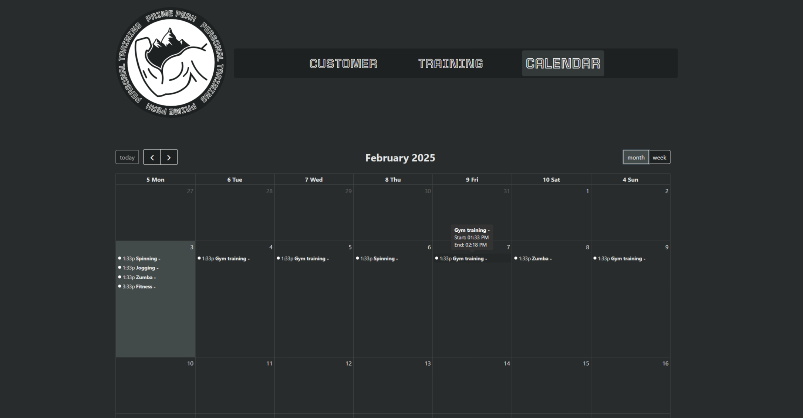

# PrimePeak-PT

PrimePeak-PT is a personal training management application designed to help trainers manage their clients, training sessions, and schedules efficiently. This project is my final assignment for the Haaga-Helia front-end course.

## 🚀 Live Demo

Check out the live demo of the application [**here**](https://maajoo.github.io/PrimePeak-PT/).

## 📋 Table of Contents

- [Features](#features)
- [Installation](#installation)
- [Usage](#usage)
- [Screenshots](#screenshots)
- [Technologies Used](#technologies-used)

## ✨ Features

- Manage customer information
- Schedule and track training sessions
- View training calendar
- Generate training reports and charts

## 🛠️ Installation

1. Clone the repository:
    ```sh
    git clone https://github.com/Maajoo/PrimePeak-PT.git
    ```
2. Navigate to the project directory:
    ```sh
    cd PrimePeak-PT
    ```
3. Install dependencies:
    ```sh
    npm install
    ```
4. Start the development server:
    ```sh
    npm run dev
    ```

## 📖 Usage

1. Open your browser and navigate to `http://localhost:5173`.
2. Use the navigation menu to access different sections of the app.
3. Add, edit, and delete customers and training sessions as needed.
4. View the training calendar and generate reports.

## 📸 Screenshots

<div style="display: flex; flex-wrap: wrap; gap: 10px;">
  
  
  
</div>
<div style="display: flex; flex-wrap: wrap; gap: 10px;">
  
  
  
</div>

## 🛠️ Technologies Used

- React
- React DOM
- React Router DOM
- FullCalendar (core, daygrid, react, timegrid)
- AG Grid (community, react)
- Day.js
- LocalForage
- Lodash
- Match Sorter
- React Slideshow Image
- Recharts
- Tippy.js